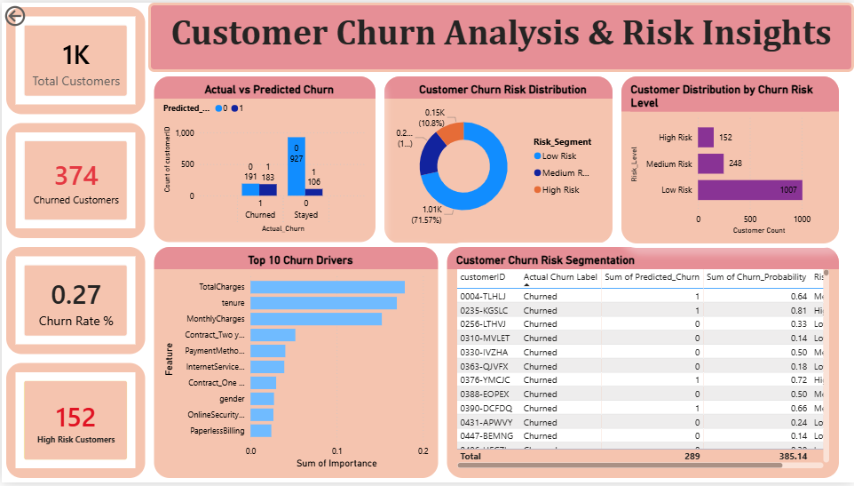

# FUTURE_ML_02  
## 🚨 Customer Churn Prediction System

### 📌 Project Overview
This project focuses on building a **Customer Churn Prediction System** using machine learning techniques.  
The objective is to identify customers who are likely to stop using a service and present actionable insights through an interactive **Power BI dashboard**.

---

### 🧠 Problem Statement
Customer retention is critical for businesses, as acquiring new customers is more expensive than retaining existing ones.  
This project uses classification-based machine learning models to predict churn probability and segment customers based on risk levels, enabling proactive retention strategies.

---

### 🛠️ Tools & Technologies
- Python (Pandas, Scikit-learn)
- Jupyter Notebook / VS Code
- Power BI Desktop
- CSV datasets (Telecom Customer Churn)

---

### 📊 Workflow
1. Data exploration and cleaning  
2. Feature engineering and encoding  
3. Train-test split and model building  
4. Model evaluation using classification metrics  
5. Churn probability and risk segmentation  
6. Exporting predictions for Power BI  
7. Building an interactive churn analytics dashboard  

---

### 🤖 Machine Learning Models
- **Logistic Regression** (baseline model)
- **Random Forest Classifier** (final model)

**Problem Type:** Binary Classification  
**Target Variable:** Churn (Yes / No)

---

### 📐 Model Evaluation Metrics
- Accuracy  
- Precision  
- Recall  
- F1-score  
- ROC–AUC  
- Confusion Matrix  

Random Forest was selected due to better overall performance and feature importance insights.

---

### 📈 Dashboard Features
- Churn distribution overview  
- Customer risk segmentation (High / Medium / Low)  
- Churn probability analysis  
- Feature importance (top churn drivers)  
- KPI cards for quick decision-making  

---

### 📸 Dashboard Preview

---

### 🚀 Key Learnings
- End-to-end ML workflow for classification problems  
- Feature engineering for real-world datasets  
- Model evaluation and comparison  
- Translating ML outputs into business insights  
- Building professional dashboards in Power BI  

---

### 👤 Author
**Prathibha B C**  
Future Interns – Machine Learning Task 2
